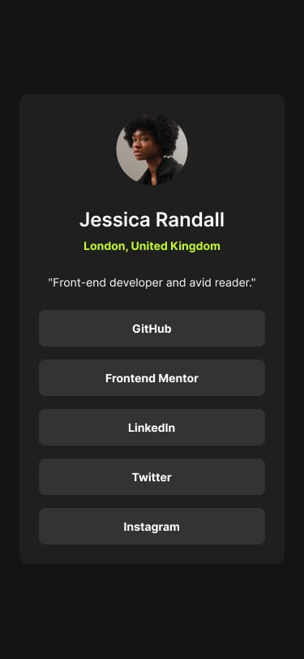

# Frontend Mentor - Social links profile solution

This is a solution to the [Social links profile challenge on Frontend Mentor](https://www.frontendmentor.io/challenges/social-links-profile-UG32l9m6dQ). Frontend Mentor challenges help me improve my coding skills by building realistic projects. 

## Table of contents

- [Overview](#overview)
  - [The challenge](#the-challenge)
  - [Screenshot](#screenshot)
  - [Links](#links)
- [My process](#my-process)
  - [Built with](#built-with)

## Overview

### The challenge

Users should be able to:

- See hover and focus states for all interactive elements on the page

### References Screenshots

### Links

- Solution URL: https://www.frontendmentor.io/solutions/social-links-profile---html-and-css-responsive-card-component-M5FxScOFyj
- Live Site URL: https://samuelabreu74.github.io/Social-links-profile/ 

## My process

### Built with

- Semantic HTML5 markup
- CSS responsive style
- Flexbox
- Mobile-first workflow

## Author

- Frontend Mentor - [@SamuelAbreu74](https://www.frontendmentor.io/profile/SamuelAbreu74)
- Instagram - [@samuelabreu.dev](https://www.instagram.com/samuelabreu.dev/)

